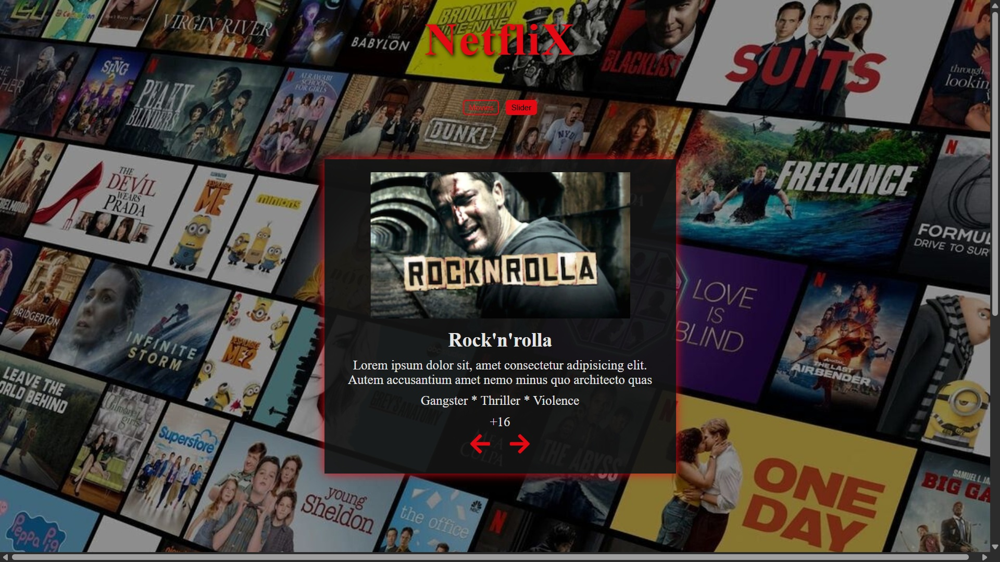
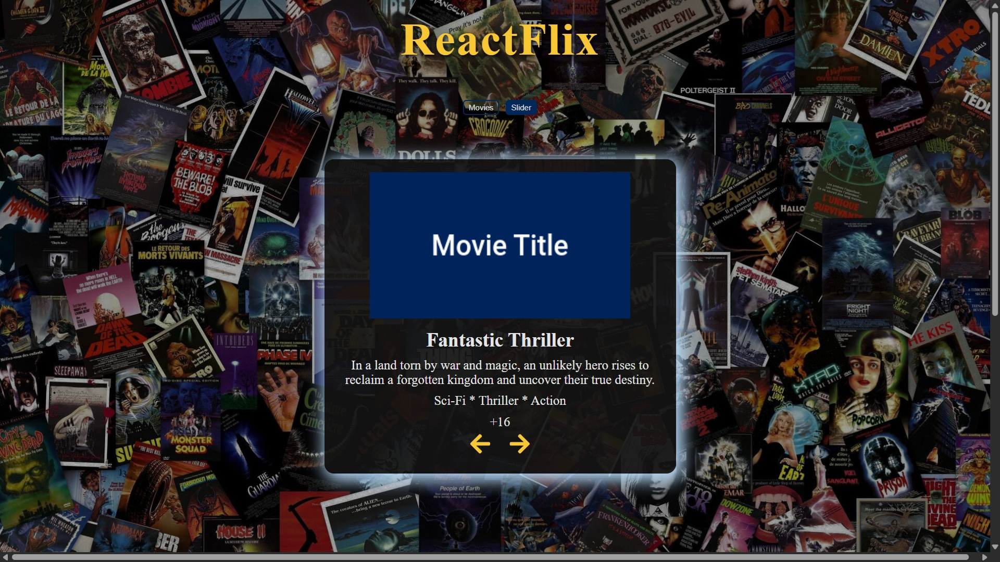

# 🎬 React Movie Slider & FAQ App

A sleek and responsive React application showcasing a movie gallery, interactive movie slider, and FAQ section. Inspired by Netflix's UI style. Built to demonstrate proficiency in React, component structure, state management, and modern CSS styling.

---

## 🛠️ Features

- 🎞️ **Movies View**: Grid layout of movies with title, genre, description, and age rating.
- 🎠 **Movie Slider**: Auto-playing, manually controlled slider displaying movie details one at a time.
- ❓ **FAQ Section**: Accordion-style toggle to show/hide answers to frequently asked questions.
- 🌙 **Dark Mode UI**: Netflix-inspired styling with custom colors and shadows.
- 🔁 **Responsive Design**: Mobile-first, adapts to various screen sizes.

---

## 📸 Preview

 
 

---

## 📂 Folder Structure
<pre>
src/
│
├── components/
│ ├── Movies.js
│ ├── OneMovieSlider.js
│ └── Question.js
│
├── styles/
│ ├── index.css
│ ├── Movies.css
│ ├── OneMovieSlider.css
│ └── Question.css
│
├── data.js
├── questions.js
└── App.js
</pre>

---
## ⚙️ Technologies Used

- ⚛️ **React** (Hooks & Components)
- 💅 **CSS** (custom + responsive layout)
- 🎨 **Icons**: [React Icons](https://react-icons.github.io/react-icons/)
- 📁 **Data Management**: Static JSON files (`data.js`, `questions.js`)